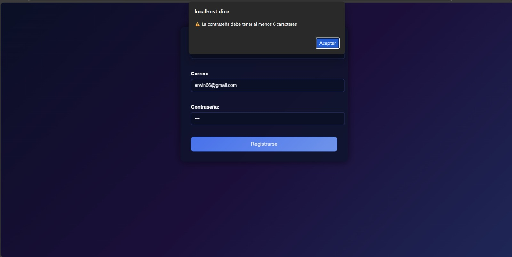
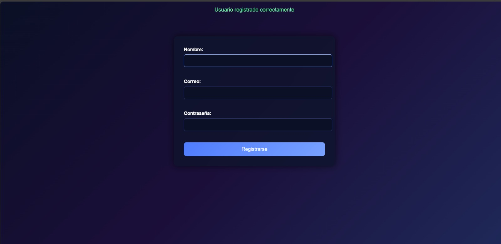
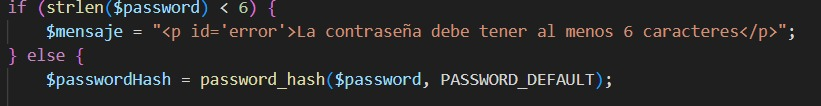
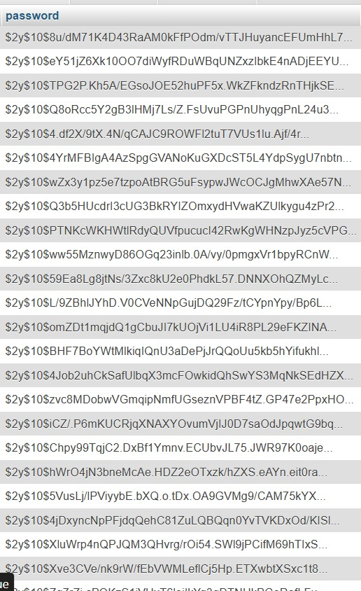
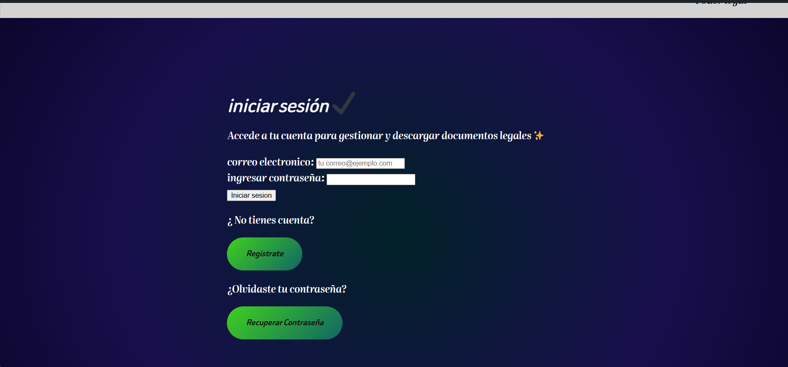
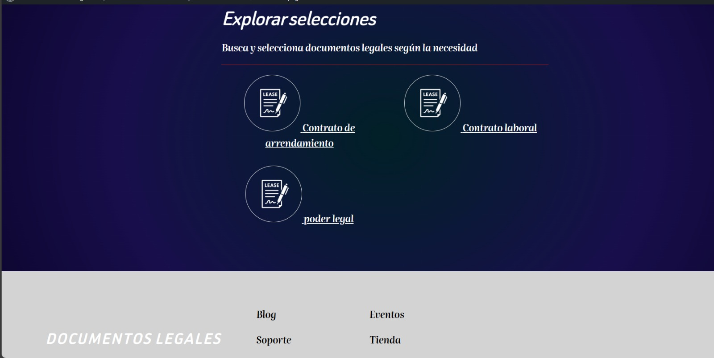

# 📄 Sistema de Registro y Gestión de Documentos Legales

💻Proyecto desarrollado  orientado a  desarrollo backend, diseño de pagina  y control de versiones💻

🎯 Objetivo del proyecto

Desarrollar un sistema web funcional que permita:

✅ Registro e inicio de sesión de usuarios
✅ Exploración y selección de documentos legales
✅Gestión de procesos de compra
✅Organización de roles (cliente / administrador)

🤓👉El proyecto combina wordPress para el diseño de páginas, HTML y CSS personalizados, y PHP + MySQL + JavaScript para la lógica del sistema.

🛠️ Tecnologías utilizadas

👉 **HTML** – Estructura de formularios y páginas
 👉**CSS** – Diseño visual personalizado y responsive
 👉**JavaScript** – Validación de formularios en el cliente
 👉**PHP** – Lógica del servidor y procesamiento de datos
👉**MySQL** – Almacenamiento de información
👉**WordPress** – Maquetación y diseño de múltiples páginas
👉**Git & GitHub** – Control de versiones y repositorio

 📂 Funcionalidades desarrolladas
                👇            
### 🔐 Autenticación de usuarios

🟢 Registro de usuario con validación en JavaScript
🟢 Validación en backend con PHP
🟢 Limpieza automática del formulario tras registro exitoso

### 📑 Gestión de documentos legales

📄 Página de documentos legales
Visualización de documentos como:

  📄 Contrato de arrendamiento
📄Contrato laboral
📄Poder legal

### 🛒 Flujo de compra

👉Carrito de compras
👉 Confirmación de compra
🟢Compra aprobada
🔴 Compra rechazada / no aprobada
 👉 Transacciones

## 🖥️ Páginas diseñadas en WordPress (25+)

El diseño del sitio incluye páginas como:

✅Inicio de sesión
✅ Registro
✅ Recuperar contraseña
✅ Cambiar contraseña
✅ Panel del cliente
✅ Panel del administrador
✅ Carrito de compras
✅ Métodos de pago
✅ Confirmar compra
✅ Compra aprobada
✅ Compra rechazada
✅Compra no aprobada
✅ Transacciones
✅ Explorar selecciones
✅ Favoritos
✅ Resultados de búsqueda
✅ Opiniones
✅ Soporte
✅ Política de privacidad
✅ Términos y condiciones
✅ Documentos legales

💻Todas estas páginas fueron **diseñadas visualmente en WordPress** y complementadas con **HTML y CSS personalizados**.💻

 🔵## 🎨 Diseño y estilos 🔵

⭐ Uso de degradados azul–morado
⭐ Formularios con fondo oscuro translúcido
⭐ Estilo coherente en todo el sistema
⭐ CSS personalizado aplicado a formularios PHP

🔭 El formulario de registro fue estilizado para integrarse completamente con el diseño visual del sitio.

## 🧠 Aprendizajes clave

* Integración entre frontend y backend
* Validación doble (JavaScript + PHP)
* Manejo de errores y mensajes al usuario
* Uso práctico de Git y GitHub
* Organización de un proyecto real orientado a empresa

## 📸 Evidencias del proyecto

### 📝 Registro de usuarios
**Validación de contraseña (mínimo 6 caracteres)**

### 🔐 Seguridad de contraseñas
**Uso de password_hash() en PHP**

### 🔑 Inicio de sesión

### 🧭 Navegación del sistema

## 👤 Autor

**Erwin Arley Cuaspa**
Desarrollador en formación 

