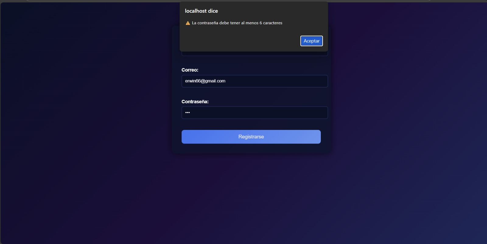
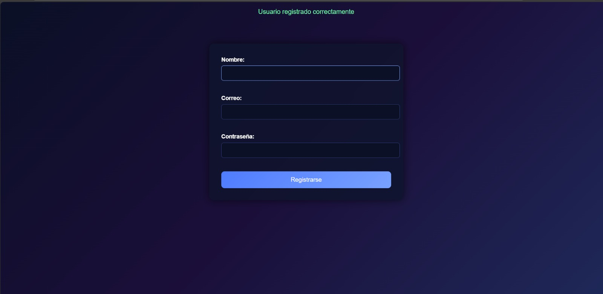
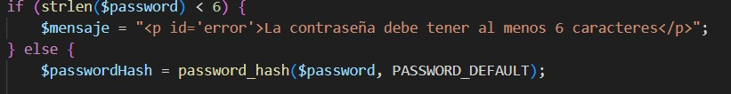
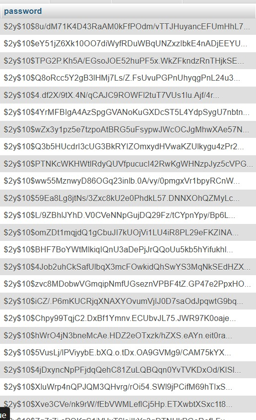
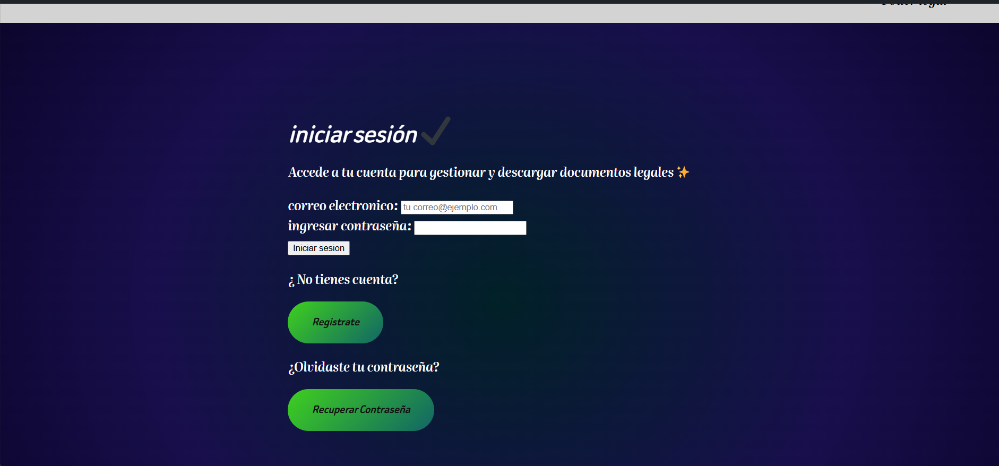
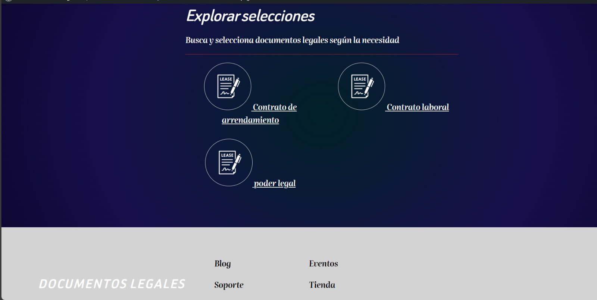

#  Sistema de Registro y Gestión de Documentos Legales

- Proyecto desarrollado  orientado a  desarrollo backend, diseño de pagina  y control de versiones

 - Objetivo del proyecto:

- Desarrollar un sistema web funcional que permita:

✅ Registro e inicio de sesión de usuarios
✅ Exploración y selección de documentos legales
✅Gestión de procesos de compra
✅Organización de roles (cliente / administrador)

- El proyecto combina wordPress para el diseño de páginas, HTML y CSS personalizados, y PHP + MySQL + JavaScript para la lógica del sistema.

- Tecnologías utilizadas

 **HTML** – Estructura de formularios y páginas
 **CSS** – Diseño visual personalizado 
 **JavaScript** – Validación de formularios en el cliente
 **PHP** – Lógica del servidor y procesamiento de datos
**MySQL** – Almacenamiento de información
**WordPress** – Maquetación y diseño de múltiples páginas
**Git & GitHub** – Control de versiones y repositorio

 - Funcionalidades desarrolladas:
                            
###  Autenticación de usuarios

🟢 Registro de usuario con validación en JavaScript
🟢 Validación en backend con PHP
🟢 Limpieza automática del formulario tras registro exitoso

###  Gestión de documentos legales

📄 Página de documentos legales
Visualización de documentos como:

  📄 Contrato de arrendamiento
📄Contrato laboral
📄Poder legal

### Flujo de compra

👉Carrito de compras
👉 Confirmación de compra
🟢Compra aprobada
🔴 Compra rechazada / no aprobada
 👉 Transacciones

##  Páginas diseñadas en WordPress 

El diseño del sitio incluye páginas como:

✅**Inicio de sesión**: Página encargada de la autenticación de los usuarios, permitiendo el acceso seguro al sistema mediante credenciales previamente registradas.
✅ **Registro**: Formulario destinado a la creación de nuevas cuentas de usuario, donde se recopilan los datos necesarios para el acceso a la plataforma.
✅ **Recuperar contraseña**: Permite al usuario iniciar el proceso de recuperación de contraseña en caso de olvido, garantizando la continuidad del acceso.
✅ **Cambiar contraseña**: Sección donde el usuario puede modificar su contraseña actual, fortaleciendo la seguridad de su cuenta.
✅ **Panel del cliente**: Área privada donde el usuario puede gestionar su perfil, pedidos y configuraciones personales.
✅ **Panel del administrador**: Sección de control destinada a la administración general del sistema, usuarios y contenidos.
✅ **Carrito de compras**: Sección donde el usuario gestiona los elementos seleccionados antes de proceder al proceso de compra.
✅ **Métodos de pago**: Sección donde el usuario selecciona y gestiona las opciones de pago disponibles.
✅ **Confirmar compra**: Página de validación final en la cual el usuario revisa los detalles de la compra antes de confirmarla.
✅ **Compra aprobada**: Pantalla informativa que notifica al usuario que la transacción fue realizada de manera exitosa.
✅ **Compra rechazada**: Indica que la transacción no pudo completarse debido a un error o rechazo del método de pago.
✅**Compra no aprobada**: Página que informa que la compra quedó pendiente o no fue autorizada por el sistema.
✅ **Transacciones**: Historial que permite consultar las operaciones y compras realizadas dentro de la plataforma.
✅ **Explorar selecciones**: Espacio diseñado para la visualización y exploración del contenido, productos o servicios disponibles en la plataforma.
✅ **Favoritos**: Permite al usuario almacenar y consultar elementos de interés para un acceso rápido posterior.
✅ **Resultados de búsqueda**: Página que presenta los resultados obtenidos tras realizar una búsqueda específica dentro del sistema.
✅ **Opiniones**: Espacio destinado para que los usuarios compartan comentarios o valoraciones sobre su experiencia.
✅ **Soporte**: Página diseñada para la atención al usuario, permitiendo la gestión de dudas, solicitudes o inconvenientes.
✅ **Política de privacidad**: Documento informativo que describe el tratamiento y protección de los datos personales de los usuarios.
✅ **Términos y condiciones**: Página que establece las normas, derechos y deberes relacionados con el uso de la plataforma.
✅ **Documentos legales**: Espacio destinado a documentos legales y normativos asociados a la plataforma.

- Todas estas páginas fueron diseñadas visualmente en WordPress y complementadas con HTML y CSS personalizados

 - **Diseño y estilos** 

⭐ Uso de degradados azul–morado
⭐ Formularios con fondo oscuro translúcido
⭐ Estilo coherente en todo el sistema
⭐ CSS personalizado aplicado a formularios PHP

- El formulario de registro fue estilizado para integrarse completamente con el diseño visual del sitio.

##  Resumen de lo que se uso y se aplico al proyecto

🟢 Integración entre frontend y backend
🟢 Validación doble (JavaScript + PHP)
🟢 Manejo de errores y mensajes al usuario
🟢 Uso práctico de Git y GitHub
🟢 Organización de un proyecto real orientado a empresa

##  Evidencias del proyecto

### 📝 Registro de usuarios
**Validación de contraseña (mínimo 6 caracteres)**

### 🔐 Seguridad de contraseñas
**Uso de password_hash() en PHP**

###  Inicio de sesión

###  Navegación del sistema

## 👤 Autor

**Erwin Arley Delgado**
Desarrollador en formación 

